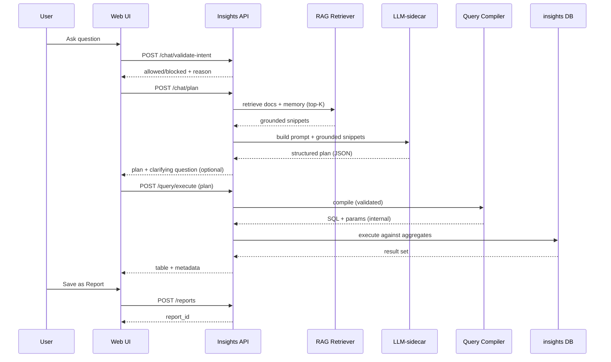
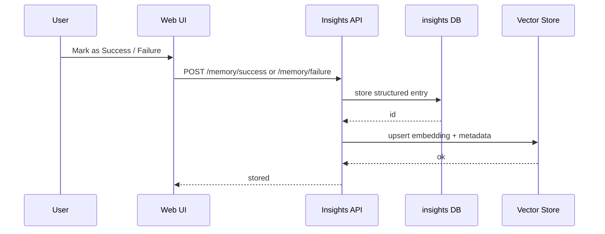

# Intelis Insights – Product Requirements Document (PRD)

Version: v2.0
Scope: Dashboard + Saved Reports + Conversational Authoring + RAG (Knowledge Assistance)
Target System: Intelis (FOSS Laboratory Information System)

---

# 1. Executive Summary

Intelis Insights is a governed analytics platform built on top of Intelis. Its purpose is to transform laboratory data into actionable program intelligence while maintaining strict privacy controls.

This is NOT a generic chat-over-database tool.

It is a structured insight engine with:

* Smart Dashboard (predefined national indicators)
* Saved Reports (reusable structured analyses)
* Conversational Authoring (AI-assisted query building)
* Knowledge Assistance (RAG-powered, privacy-safe)

The system must:

* Never expose patient-level data
* Never allow unrestricted SQL generation
* Use standardized indicator definitions
* Support multi-disease programs
* Work in low-resource environments
* Be fully open-source and sustainable

---

# 2. Core Design Principles

1. Privacy by architecture
2. Aggregate-only analytics
3. Standardized indicator definitions
4. Deterministic query execution
5. AI-assisted interpretation (not AI-controlled execution)
6. Modular and optional AI components
7. Disease-agnostic extensibility
8. Auditability and transparency

---

# 3. System Architecture Overview

## 3.1 Data Boundary

Two logical databases:

* `intelis` → Operational LIS database (raw patient data)
* `intelis_insights` → Aggregate-only analytics schema

Hard Rule:

* Runtime analytics user MUST NOT have access to raw operational tables.
* All analytics queries execute ONLY against aggregate tables.

---

## 3.2 High-Level Flow

User
↓
Insights API (Slim PHP)
↓
Intent Validation
↓
RAG Retrieval (definitions only)
↓
Structured Query Plan (JSON)
↓
Deterministic SQL Compiler
↓
Aggregate Tables (`intelis_insights`)
↓
Dashboard / Reports / Chat Output

LLM never directly executes SQL.

---

# 4. Core Functional Modules

---

# 4.1 Smart Dashboard

Purpose:
Provide immediate executive-level visibility into key indicators.

Characteristics:

* Predefined national indicators
* Multi-disease support
* Fixed layout components
* Governed metric definitions
* No ad-hoc SQL

Examples (Phase 1):

* Test volume (12-month trend)
* Turnaround time summary
* Rejection rate summary
* Backlog distribution
* Regional comparison

Dashboard elements are backed by canonical metrics only.

---

# 4.2 Saved Reports

Purpose:
Allow reusable, structured analytics.

Users can:

* Save chat-generated insights
* Pin to dashboard
* Schedule delivery (future phase)
* Share within role scope

## Report Definition Model

```json
{
  "id": "uuid",
  "title": "TB Positivity by District (Last 6 Months)",
  "metric": "tb_positivity_rate",
  "dimensions": ["district"],
  "filters": {
    "disease": "TB"
  },
  "time_range": {
    "start": "2026-01-01",
    "end": "2026-06-30",
    "bucket": "month"
  },
  "chart_type": "bar",
  "created_by": "user_id",
  "access_scope": "national",
  "created_at": "timestamp"
}
```

Important:

* Reports store structured definitions, not SQL text.

---

# 4.3 Conversational Authoring

Purpose:
Allow users to generate structured reports via natural language.

## Flow

1. User submits question.
2. Intent validation (scope check).
3. RAG retrieves relevant definitions.
4. LLM produces structured JSON.
5. System validates metric + filters.
6. SQL compiler generates approved query.
7. Query runs against aggregate tables.
8. Results displayed.
9. User may save as report.

Chat is a report creation tool, not a one-off query tool.

---

# 5. Canonical Metrics Layer

All analytics must map to predefined metrics.

Example Metrics:

* tat_collection_to_result_release
* tb_positivity_rate
* volume_by_region
* rejection_rate_by_lab
* backlog_age_distribution

Each metric definition includes:

* Formula
* Valid dimensions
* Valid filters
* Grain level
* Suppression rules
* Documentation reference

Stored in YAML registry.

---

# 6. AI Integration Model

AI is used for:

* Intent clarification
* Semantic mapping
* Definition grounding (RAG)
* Chart recommendation
* Optional narrative summaries

AI is NOT used for:

* Direct SQL execution
* Accessing patient data
* Overriding suppression rules

---

# 7. Knowledge Assistance (RAG)

Purpose:
Ground AI responses in approved documentation.

RAG Data Sources:

* Indicator definitions
* Business rules
* National SOP documents
* Metric documentation

Restrictions:

* No patient-level content indexed
* No operational tables indexed
* Only approved static documents

Use Cases:

* “What is positivity rate?”
* “How is turnaround time calculated?”
* “What qualifies as backlog?”

---

# 8. Privacy & Governance

## 8.1 Data Isolation

* Raw data in `intelis`
* Aggregates in `intelis_insights`
* Analytics user: SELECT only on insights schema

## 8.2 Suppression Rules

* No group displayed when n < 5
* No drill-down to patient level
* No facility-level exposure below threshold

## 8.3 Audit Logging

Log:

* User ID
* Timestamp
* Metric used
* Filters applied
* Report saved or not

---

# 9. Multi-Disease Support

System must support:

* HIV
* TB
* EID
* Hepatitis
* Emerging pathogens

Architecture must:

* Avoid hard-coded disease logic
* Support extension via new metric definitions

---

# 10. Charting Engine

System must:

* Recommend chart types
* Support bar, line, pie, stacked, time-series
* Allow alternate visual formats
* Store chart preference in report definition

---

# 11. User Roles & RBAC

Example Roles:

* National Admin
* Regional Manager
* Lab Manager
* Viewer

Controls:

* Disease visibility
* Regional visibility
* Report access
* Dashboard modification

---

# 12. Non-Functional Requirements

* Works offline
* Low memory footprint
* Compatible with low-resource servers
* No mandatory external cloud dependencies
* AI layer optional

---

# 13. Phase 1 Scope

Include:

* VL support
* Canonical metrics registry
* Dashboard
* Saved reports
* Conversational authoring
* RAG knowledge assistance
* Privacy enforcement
* Audit logging

Exclude:

* Predictive modeling
* Cross-country benchmarking
* Alert automation

---

# 14. Success Criteria

* Zero patient-level exposure
* Consistent metric outputs
* Reusable saved reports
* Reduced manual reporting effort
* Multi-disease extensibility
* Positive stakeholder validation

---

---

# 15. Adaptive Learning & Conversational Memory (Optional, Governed)

Intelis Insights may support an optional, governed "learning memory" layer to improve conversational authoring quality over time.

This memory is **not** raw chat logging for AI training.
It is a curated, privacy-safe knowledge improvement mechanism.

## 15.1 Purpose

* Improve semantic mapping accuracy
* Reduce repeated misunderstandings
* Capture country-specific terminology
* Preserve successful structured query examples
* Document edge cases and disallowed patterns

## 15.2 Memory Types

Two distinct memory collections must exist:

### A. Successful Patterns

Stored when user explicitly marks interaction as correct.

Example structure:

```json
{
  "id": "uuid",
  "user_question": "How many TB positives last quarter by district?",
  "resolved_metric": "tb_positivity_rate",
  "dimensions": ["district"],
  "filters": {"time_range": "last_quarter"},
  "country_context": "country_code",
  "validated_by_user": true,
  "timestamp": "ISO8601"
}
```

These are indexed in vector store for semantic retrieval.

### B. Failed or Corrected Patterns

Stored when:

* AI misinterprets intent
* Metric was mapped incorrectly
* User manually corrects structure

Example:

```json
{
  "id": "uuid",
  "original_question": "Show TB backlog",
  "incorrect_mapping": "volume_by_region",
  "correct_mapping": "backlog_age_distribution",
  "notes": "User clarified backlog means pending > 7 days",
  "timestamp": "ISO8601"
}
```

These are used to prevent repeat semantic mistakes.

## 15.3 Governance Rules

* Users must explicitly opt-in to store interaction
* Memory must not store patient-level data
* Memory must not store raw query results
* Only structured query metadata is stored
* Memory must be editable and deletable
* Administrators may review stored patterns

## 15.4 Retrieval Model

During conversational authoring:

1. Intent validation
2. Retrieve relevant past successful/failed patterns via vector similarity
3. Provide retrieved patterns as context to LLM
4. LLM produces structured JSON
5. System validates and compiles

## 15.5 Privacy Safeguards

* No raw data stored in memory
* No SQL text stored
* Only structured metric definitions / query plans
* Optional country-level isolation of memory collections
* Clear audit log of memory insertions

## 15.6 System Controls

Admin-level controls must allow:

* Enable / disable memory system
* Review stored patterns
* Delete patterns
* Export patterns
* Clear memory entirely

## 15.7 Non-Goals

This system does NOT:

* Automatically retrain LLM models
* Modify canonical metric definitions without review
* Override suppression rules
* Grant new data access rights

---

# 15A. API Specification (Required for Coding Agents)

All endpoints are served by the **Insights API** (Slim PHP app). All responses are JSON.

## 15A.1 Authentication

* Auth scheme: **JWT** (recommended), with refresh tokens (optional for Phase 1)
* Every request must include `Authorization: Bearer <token>`
* Tokens include: `user_id`, `role`, `country_context`, and optional `org_unit_scope`

## 15A.2 Common Conventions

* `X-Request-Id` header supported (client may send; server echoes in response)
* Standard error format:

```json
{
  "error": {
    "code": "string",
    "message": "string",
    "details": {}
  }
}
```

* All list endpoints support pagination:

  * `?page=1&per_page=20`
  * Response includes `meta.total`, `meta.page`, `meta.per_page`

---

## 15A.3 Chat / Query Endpoints

### POST `/v1/chat/validate-intent`

Validates scope and intent before any planning.

Request:

```json
{ "question": "...", "context": {"disease": "TB"} }
```

Response:

```json
{ "allowed": true, "reason": null, "normalized_intent": "analytics_query" }
```

### POST `/v1/chat/plan`

Returns a **structured query plan** (no SQL).

Request:

```json
{
  "question": "Show TB positivity rate by district last 6 months",
  "ui_context": {"country_context": "XX"}
}
```

Response (example):

```json
{
  "plan": {
    "metric": "tb_positivity_rate",
    "dimensions": ["district"],
    "filters": {"time_range": "last_6_months"},
    "time_bucket": "month",
    "result_shape": "timeseries"
  },
  "clarifying_question": null,
  "citations": ["metric_registry:tb_positivity_rate", "sop:surveillance_definitions"]
}
```

### POST `/v1/query/execute`

Executes a validated plan via deterministic compiler.

Request:

```json
{ "plan": {"metric":"...", "dimensions":[], "filters":{}}, "format": "table" }
```

Response:

```json
{
  "data": {
    "columns": ["month", "district", "positivity_rate"],
    "rows": [["2026-01", "X", 0.12]]
  },
  "suppressed": false,
  "meta": {"metric": "tb_positivity_rate", "generated_at": "..."}
}
```

### POST `/v1/chart/suggest`

Suggest chart types for returned data.

Request:

```json
{ "data_profile": {"columns": [...], "row_count": 120}, "preferred": null }
```

Response:

```json
{ "recommended": ["line", "bar"], "alternatives": ["stacked_bar"] }
```

---

## 15A.4 Reports Endpoints

### GET `/v1/reports`

List reports visible to user.

### POST `/v1/reports`

Create a report from a plan + chart spec.

Request:

```json
{
  "title": "TB Positivity by District (Last 6 Months)",
  "plan": {"metric":"tb_positivity_rate", "dimensions":["district"], "filters":{"time_range":"last_6_months"}},
  "chart": {"type":"bar", "x":"district", "y":"positivity_rate"},
  "access_scope": "role:regional_manager"
}
```

Response:

```json
{ "id": "uuid", "status": "created" }
```

### GET `/v1/reports/{id}`

Fetch report definition.

### PUT `/v1/reports/{id}`

Update report definition (title, filters, chart type, access scope).

### DELETE `/v1/reports/{id}`

Delete report.

### POST `/v1/reports/{id}/pin`

Pin report to dashboard.

### POST `/v1/reports/{id}/unpin`

Unpin.

---

## 15A.5 Dashboard Endpoints

### GET `/v1/dashboard`

Returns:

* default widgets
* pinned reports
* user preferences

### PUT `/v1/dashboard/layout`

Update dashboard layout (widget ordering, visibility).

---

## 15A.6 Memory (Self-Learning) Endpoints

All memory write operations must be **explicitly initiated by user**.

### GET `/v1/memory`

List memory entries (admin or owner scope).

### POST `/v1/memory/success`

Store a successful interaction pattern.

Request:

```json
{
  "question": "...",
  "plan": {"metric":"...", "dimensions":[], "filters":{}},
  "notes": "optional",
  "visibility": "country" 
}
```

### POST `/v1/memory/failure`

Store a failed/corrected pattern.

Request:

```json
{
  "question": "...",
  "incorrect_plan": {...},
  "correct_plan": {...},
  "notes": "...",
  "visibility": "country"
}
```

### DELETE `/v1/memory/{id}`

Delete memory entry.

### POST `/v1/memory/reindex`

Admin-only: rebuild vector index from stored memory.

---

# 15B. Vector Indexing Specification (RAG)

The vector store must support **two indices**:

1. `docs_index` – approved documents (SOPs, definitions)
2. `memory_index` – curated user-marked successful/failed patterns

## 15B.1 Document Chunk Schema

Each chunk must include:

* `id` (uuid)
* `source_type` = `sop` | `metric_registry` | `policy` | `reference`
* `source_id` (document identifier)
* `country_context` (optional)
* `title`
* `chunk_text`
* `hash` (for de-duplication)
* `created_at`, `updated_at`

Vector metadata MUST include:

* `visibility`: `global` | `country:<code>`
* `sensitivity`: always `non_pii`

## 15B.2 Memory Chunk Schema

* `id` (uuid)
* `type`: `success` | `failure`
* `question`
* `plan` (for success) or `incorrect_plan` + `correct_plan` (for failure)
* `notes`
* `country_context`
* `created_by`
* `created_at`

Embeddable text for retrieval should be a templated string (example):

* Success: `Q: <question> | Metric: <metric> | Dims: ... | Filters: ...`
* Failure: `Q: <question> | Wrong: <metric> | Correct: <metric> | Notes: ...`

## 15B.3 Retrieval Policy

At planning time:

* Retrieve top-K from `memory_index` (e.g., K=3–5)
* Retrieve top-K from `docs_index` (e.g., K=3–5)
* Apply filters:

  * `visibility` must match user country context
  * deny any `sensitivity != non_pii`

---

# 15C. Canonical Metric Registry – YAML Schema (Formal)

The metric registry is the source of truth. It must be machine-validated.

## 15C.1 Top-Level Structure

```yaml
version: "1.0"
metrics:
  - id: tb_positivity_rate
    name: "TB positivity rate"
    description: "Proportion of positive TB tests among tests with a valid result"
    owners: ["national_admin"]
    status: "active"  # active|draft|deprecated
    disease_tags: ["TB"]
    grain: "district-month"  # declares the finest supported aggregation
    measures:
      - key: positivity_rate
        type: "ratio"  # count|sum|avg|ratio|percentile
        numerator: "tb_positive_count"
        denominator: "tb_tested_count"
        format: "percent"
    dimensions:
      allowed: ["country", "region", "district", "lab", "facility"]
      defaults: ["district"]
    filters:
      allowed:
        - key: time_range
          type: "time_range"
          allowed_values: ["last_30_days", "last_6_months", "last_12_months", "custom"]
        - key: specimen_type
          type: "enum"
          allowed_values: ["sputum", "other"]
    privacy:
      suppression_threshold: 5
      allow_facility_level: true
    sources:
      tables:
        - agg_tb_monthly
      fields:
        positivity_rate: "positivity_rate"
    sql_templates:
      base: "SELECT ... FROM agg_tb_monthly WHERE ..."
    examples:
      - question: "TB positivity rate by district last 6 months"
        plan:
          dimensions: ["district"]
          filters: {time_range: "last_6_months"}
```

## 15C.2 Validation Rules

* Each metric `id` must be unique
* `sources.tables` must refer only to tables in `intelis_insights`
* `privacy.suppression_threshold` must exist and be >= 5 (default 5)
* `dimensions.allowed` must be subset of global dimension vocabulary
* `filters.allowed[*].type` must be one of supported filter types
* If `type: ratio`, both numerator and denominator must be defined

---

# 15D. Sequence Diagrams (Mermaid)

## 15D.1 Conversational Authoring → Execute → Save as Report



## 15D.2 User-Marked Memory Capture (Success/Failure)



---

# 16. Long-Term Vision – LIS-Agnostic Architecture (Future Phase)

– LIS-Agnostic Architecture (Future Phase)

The Insights Engine should be designed so it can eventually operate independently of Intelis.

## 16.1 Canonical Analytics Contract

Define a normalized analytics contract independent of Intelis tables:

Required abstract fields:

* sample_collection_date
* result_date
* test_type
* lab_id
* facility_id
* region
* rejection_flag
* result_status

Each LIS must map its schema to this canonical model.

---

## 16.2 Adapter Layer (Future)

External LIS
↓
Adapter / Mapping Layer
↓
Normalized Analytics Schema
↓
Insights Engine

Adapters may be implemented via:

* ETL mappings
* FHIR feeds
* CSV ingestion
* API connectors

---

## 16.3 Design Constraint for Phase 1

Even though Phase 1 is Intelis-native, implementation must:

* Avoid hard-coded table assumptions
* Use canonical metric registry
* Separate ingestion from analytics

This ensures future portability.

---

END OF DOCUMENT
