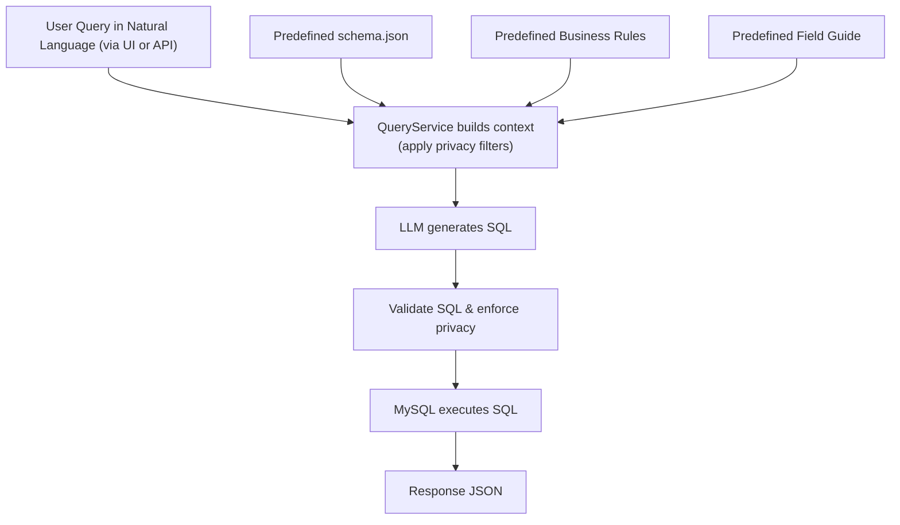

# InteLIS Insights

Convert natural‑language questions into SQL for the InteLIS database. Runs a query plan through an LLM, validates the SQL, executes it, and returns results (with privacy rules enforced).

## Quick Start

1. **Install deps**

```bash
composer install
```

1. **Export the DB schema** (required)

```bash
php ./bin/export-schema.php
```

This generates `var/schema.json`. Re‑run it whenever the database schema changes.

## Use It

- **Web UI**: open `/chat` and ask a question.

- **API**:

  - **Ask a question**

    ```http
    POST /ask
    Content-Type: application/json
    {
      "q": "How many VL tests in the last 6 months?",
      "provider": "ollama|openai|anthropic",  
      "model": "optional-model-id"
    }
    ```

    **Response (minimal shape)**

    ```json
    {
      "sql": "SELECT …",
      "rows": [ { "col": "val" } ],
      "timing": { "provider": "…", "model_used": "…", "total_ms": 0 }
    }
    ```

  - **Clear conversation context** (reset the server-side context window)

    ```http
    POST /ask
    Content-Type: application/json
    {
      "clear_context": true
    }
    ```

    **Response**

    ```json
    { "message": "Conversation context cleared", "context_reset": true }
    ```

    *Note:* when `clear_context` is `true`, it is handled immediately and any `q` value (if present) is ignored for that request.

## Workflow

**High-level flow**
1. **User asks** a question (UI `/chat` or `POST /ask`).
2. **Context is built**: user query + `var/schema.json` + business rules + field guide → prompt to the selected LLM.
3. **LLM generates SQL** (QueryService validates & enforces privacy rules).
4. **SQL is executed** against MySQL (DatabaseService).
5. **Results are returned** to the caller (rows, counts, timing, debug info).



## LLM Providers

Works with **Ollama**, **OpenAI**, and **Anthropic**. Pick a provider/model in the `/chat` settings or send `provider`/`model` in the `/ask` payload.

## Notes

- Privacy rules prevent returning disallowed columns.
- If you see “model not found”, use an explicit model id (e.g., for Anthropic use a dated id).
- If SQL generation looks off after schema changes, re‑export the schema (`export-schema.php`).