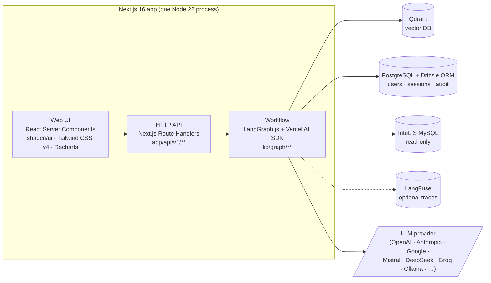
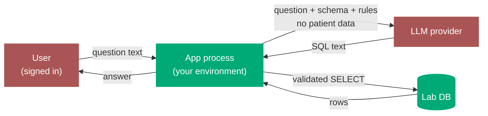
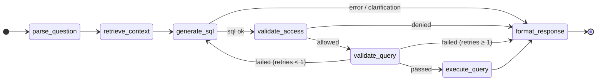
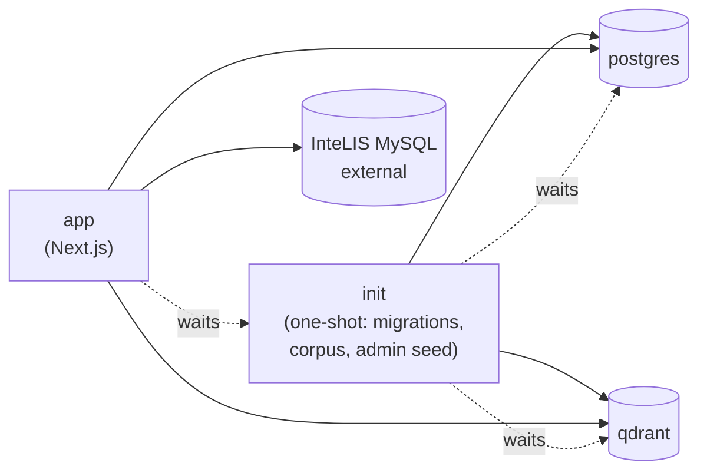

# Architecture

InteLIS Insights is a single Next.js application. The UI, the HTTP API, and the workflow that turns natural-language questions into SQL all run in one Node process.

For a step-by-step picture of what happens when a user asks a question, see [How a query flows](./query-flow.md).

## High-level

### Stack

Every load-bearing component is an industry-standard, permissively-licensed, FOSS project with an active maintainer community. No proprietary runtime, no SaaS dependency, no obscure framework that ties the codebase to one vendor or one contributor. A typical full-stack TypeScript engineer can be productive on day one.

| Concern | Choice | Why this, not the alternative |
|---|---|---|
| App framework | [Next.js 16](https://nextjs.org) (App Router) | Most widely deployed React framework. Huge talent pool. Vercel-led but fully self-hostable. |
| Workflow engine | [LangGraph.js](https://langchain-ai.github.io/langgraphjs/) | The de facto graph runtime for agentic LLM apps; checkpointing, retries, and observability built in. |
| LLM provider layer | [Vercel AI SDK](https://sdk.vercel.ai) | One API across every major provider — swap OpenAI / Anthropic / Google / local without code changes. |
| Vector DB | [Qdrant](https://qdrant.tech) | Production-grade, Apache-2.0, runs as a single container. Self-hosted; no per-vector pricing. |
| Auth | [Auth.js v5](https://authjs.dev) | Standard for Next.js auth; supports email/password today, SSO/SAML when ministries need it. |
| App database | [PostgreSQL](https://www.postgresql.org) + [Drizzle ORM](https://orm.drizzle.team) | The default boring choice. Every operator already knows how to run, back up, and monitor it. |
| UI | [shadcn/ui](https://ui.shadcn.com) + [Tailwind CSS v4](https://tailwindcss.com) | Copy-in components, no UI-library lock-in. Themeable per deployment. |
| Charts | [Recharts](https://recharts.org) | Composable React charts; renders in RSC; no commercial licence. |
| Observability | [LangFuse](https://langfuse.com) | Self-hostable LLM observability. Prompts, costs, latency, eval scores — all in one place. |
| Runtime | Node 22 LTS | Long-term support, broadly available in every cloud and on-prem environment. |

The combined effect: a country IT team operates four containers (app, init, Postgres, Qdrant) — all recognisable — and depends on zero hosted services beyond the LLM endpoint they choose.

### Tool deep-dive

For each load-bearing dependency: what it actually does, why this one over the alternatives, and where it shows up in the codebase. If you're new to the stack, this is the section that ties the brand names to the file paths.

#### Next.js 16 — the application framework

**What it does.** React framework that handles everything from page rendering to API endpoints in one process. Server Components render on the server (no client JS shipped unless needed); Route Handlers are the HTTP API; streaming responses ship updates to the browser as they happen.

**Why this.** Most widely deployed React framework on earth — every TypeScript engineer has either used it or can pick it up in days. Fully self-hostable (Vercel-led but not Vercel-locked). The Server Components + streaming model is what makes the live "card-by-card" chat experience possible without bolting on a separate WebSocket layer.

**Where it fits.** Everything under `app/` is Next.js: pages, layouts, the `/api/v1/*` endpoints. `app/api/v1/query/route.ts` is the streaming endpoint that drives the whole workflow.

#### LangGraph.js — the workflow engine

**What it does.** A state-machine runtime. You declare nodes (functions) and edges (transitions), give it an initial state, and it threads the state through the graph one node at a time, streaming events as each node finishes. Built-in checkpointing means state can be saved between steps.

**Why this, not LangChain.** LangChain is a sprawling toolkit of pre-built "chains" — useful for prototypes, heavy and opaque in production. LangGraph is just the orchestration core: ~5 imports, no surprise abstractions. It does NOT touch LLMs, prompts, or retrievers — those stay in our own code where we can audit them. Critically, the "agent loop with tool calls" pattern (LangChain's default) doesn't fit us: **the LLM never holds a database connection**. Our flow is fixed and linear-ish, which is exactly what a graph models.

**Where it fits.** All of `lib/graph/`. `workflow.ts` declares the graph; `nodes/*.ts` are the 8 steps; `state.ts` is the row threaded through; `routing.ts` is the branching logic; `runner.ts` adapts LangGraph's event stream into the NDJSON the browser consumes.

#### Vercel AI SDK — the LLM provider layer

**What it does.** One API across every major LLM provider. `generateText({ model, prompt })` works whether `model` is OpenAI, Anthropic, Google, Mistral, DeepSeek, Groq, or a local Ollama endpoint. Also handles streaming, structured output, and tool calling — but we use only the basic text-in / text-out path.

**Why this.** Vendor independence is non-negotiable for ministry deployments: a country might pick a regional provider, an air-gapped local model via Ollama, or switch when contracts change. The SDK gives us provider-swap with no code change — just an env var. Alternative would be calling each provider's SDK directly and writing our own switch, which is what most projects end up doing badly.

**Where it fits.** `lib/llm/providers.ts` is the switch (read the `LLM_PROVIDER` env, return the right model). `lib/llm/structured.ts` wraps the SDK with typed helpers, caching, retries. Every node that calls an LLM (`generate-sql.ts`, `narrate-result.ts`) goes through these helpers.

#### Qdrant — the vector database (RAG)

**What it does.** Stores text snippets as embeddings (high-dimensional vectors) and finds nearest matches by cosine similarity. We use it for retrieval-augmented generation: at query time, look up the most relevant schema descriptions, business rules, and column hints, then paste them into the prompt.

**Why this.** Apache-2.0 licensed, runs as a single Docker container, no managed-service lock-in, no per-vector pricing. Alternatives like Pinecone or Weaviate are either hosted-only or operationally heavier. For our scale (a few thousand snippets per deployment), Qdrant on a small instance is more than enough.

**Where it fits.** `lib/rag/`: `qdrant.ts` is the client, `embeddings.ts` generates vectors, `search.ts` runs the two parallel searches used during retrieval, `schema-corpus.ts` ingests the schema + business-rules corpus on init. The `retrieve-context.ts` graph node consumes all of these.

#### PostgreSQL + Drizzle ORM — the application database

**What it does.** Postgres stores users, sessions, audit logs, saved reports, and the LangGraph checkpointer state. Drizzle is the type-safe query builder — schema-in-code, no hidden runtime magic, queries that read like SQL.

**Why this.** Postgres is the most boring possible database choice, which is the point: every ministry IT team already knows how to back it up, monitor it, and recover it. Drizzle is the modern alternative to Prisma — same type safety without Prisma's binary-engine, codegen, and connection-pool headaches that bite production deployments.

**Where it fits.** `lib/db/app.ts` is the Drizzle client for Postgres. `lib/db/schema.ts` defines the tables. `lib/db/lab.ts` is a separate `mysql2` pool for the read-only InteLIS connection (NOT Drizzle — that schema is external and we only `SELECT` from it).

#### Auth.js v5 — authentication

**What it does.** Sign-in, sessions, and CSRF protection for Next.js. Today we use email/password against the app database; the same library supports SSO/SAML/OAuth when ministries need it later.

**Why this.** The standard for Next.js auth — large community, well-audited, supports the auth flows ministries actually use (SSO, OAuth) without us rolling crypto. Alternatives like Clerk or Auth0 are hosted services that fail the "no SaaS dependency" rule.

**Where it fits.** `auth.ts` and `auth.config.ts` at the repo root (the framework expects them there). `lib/auth/` extends it with the InteLIS-specific RBAC helpers — turning a session into a `UserContext` with district/province/national scope. Every route handler calls `auth()` first.

#### shadcn/ui + Tailwind CSS — UI components

**What it does.** Tailwind is utility CSS — instead of writing stylesheets, you compose classes (`flex items-center gap-2 text-sm`) directly on elements. shadcn/ui is a set of accessible, themeable React components (buttons, inputs, dialogs, etc.) — but unlike traditional component libraries, you *copy the source into your repo* and own it.

**Why this.** No UI-library version lock-in (a perennial React headache). Per-deployment theming is trivial — change CSS variables in `app/globals.css` and the whole app rebrands. shadcn components are accessible by default (WCAG-compliant focus, ARIA, keyboard navigation) without us doing the work.

**Where it fits.** `components/ui/` holds the shadcn primitives. `components/chat/` and `components/chart/` are app-specific components built on top. Tokens live in `app/globals.css`.

#### Recharts — charts

**What it does.** Composable React chart components. Pass it data + a chart type (line/bar/pie/scatter), get an SVG chart that's responsive and themeable.

**Why this.** Permissively licensed, renders inside React Server Components, no commercial dependency. Heavier alternatives (Plotly, Highcharts) bring licensing complexity or huge bundle sizes; lighter alternatives (Chart.js) don't fit the React composition model as cleanly.

**Where it fits.** `components/chart/chart-renderer.tsx` is the dispatcher — it reads the `ChartSuggestion` from the graph (produced by `lib/graph/chart-heuristics.ts`) and renders the matching Recharts component.

#### LangFuse — observability

**What it does.** Captures every LLM call: prompt, response, latency, token cost, eval scores, error traces. Lets you replay a failing query, see which prompt produced a bad SQL, and track cost trends per provider.

**Why this.** Self-hostable (this matters: prompts can contain sensitive context even after PII scrub). Purpose-built for LLM workflows — generic APM tools like Datadog don't understand prompts as a first-class object. Optional in the codebase: if no `LANGFUSE_*` env vars are set, tracing is a no-op.

**Where it fits.** `lib/observability/langfuse.ts` is the client wrapper. Every LLM call in `lib/llm/structured.ts` writes a span; `runner.ts` flushes traces when a query finishes. Setting the env vars is the only step to turn it on.

#### Node 22 LTS — the runtime

**What it does.** The JavaScript runtime. Single language end-to-end means the same engineer reads UI code and workflow code; no Python ↔ Node handoff at the LLM boundary.

**Why this.** Long-term support release — security patches through April 2027. Available in every cloud, on-prem environment, and Docker base image. Alternatives (Bun, Deno) are interesting but lack the ecosystem maturity ministries need.

**Where it fits.** Everywhere. The `node:22-alpine` image is the base for both the app container and the init container in `docker-compose.yml`.

!!! info "External boundary"
    The InteLIS MySQL database is the country's live, operational lab system. We are a **read-only consumer**. The credentials in `LAB_DB_*` should be granted `SELECT` only. This service never bundles, replicates, replaces, or migrates lab data.

## The most important rule

**The LLM never holds a database connection.**

The LLM only sees text: the user's question, the database *schema* (table and column names), and the business rules. It emits text: a SQL string with structured metadata. The application — not the LLM — opens the database connection, validates the SQL, and runs it.

This is enforced by the code shape, not by the prompt. Patient data never leaves the application boundary. Every SQL the LLM emits goes through validation and access-control checks before it touches the lab DB. See [Privacy & RBAC](./privacy-and-rbac.md).

## The workflow

Every question follows the same seven steps. Each step is a function that reads the current state and returns updates. Branching happens between steps — failures route to the response builder; SQL-safety failures get one retry.

| Step | What it does |
|---|---|
| **parse-question** | Looks at the question, picks the likely tables, detects "those" / "them" follow-ups. Pure pattern matching — no LLM call. |
| **retrieve-context** | Embeds the question, runs two parallel searches in Qdrant: one for general domain hints, one for table-specific facts. Builds a compact context bundle for the prompt. |
| **generate-sql** | Calls the LLM with the question + context + a schema listing. Gets back SQL plus the assumptions it applied (default time window, default test type, etc.). |
| **validate-access** | If the user is a district or province operator, injects a `WHERE` clause restricting results to their geographic scope. National users pass through. |
| **validate-query** | SELECT-only. Tables must be in the allowlist. No patient-identifier columns (with one carve-out: `COUNT(DISTINCT …)` is allowed for unique counts). |
| **execute-query** | Runs the SQL against the read-only lab DB. Enforces a hard `LIMIT 10000`. |
| **format-response** | Suggests a chart (table / line / bar / pie / scatter, etc.) based on the result shape. Writes the audit row. |

## What runs where

| Concern | Where it lives | Built on |
|---|---|---|
| Web UI | `app/(app)/**` | Next.js 16 React Server Components, shadcn/ui, Tailwind, Recharts. |
| HTTP API | `app/api/v1/**` | Next.js Route Handlers. One streaming endpoint for queries (`/api/v1/query`); REST for sessions and admin. |
| Workflow | `lib/graph/**` | LangGraph.js. Nodes, state, routing, Postgres-backed checkpointer. |
| Prompts + provider switch | `lib/llm/**` | Vercel AI SDK across OpenAI / Anthropic / Google / Mistral / DeepSeek / Groq / OpenAI-compatible / Ollama. |
| RAG client | `lib/rag/**` | Qdrant + embeddings + the schema loader. |
| Safety + RBAC | `lib/validation/**` | SQL validator + AST-based access control (custom, ~600 LOC). |
| Auth | `auth.ts`, `lib/auth/**` | Auth.js v5 with email/password. |
| Domain knowledge | `lib/config/business-rules.ts`, `lib/config/field-guide.ts` | Plain TypeScript modules. Ported from the retired PHP. The load-bearing IP. |
| Container bootstrap | `scripts/init.ts` | One-shot Node script: Drizzle migrations, RAG corpus ingest, admin seed. |

## Where state lives

| State | Storage |
|---|---|
| Users + access scopes | Postgres |
| Chat sessions + messages | Postgres |
| Audit log (every query) | Postgres |
| Conversation memory across turns | Postgres (LangGraph checkpointer) |
| Schema + business rules + terminology, embedded | Qdrant |
| Lab data (read-only) | InteLIS MySQL — external |

All four services run independently. Re-ingesting the corpus is a single command if the source MySQL schema changes; the init container does it automatically on first boot.

## Deployment shape

One Docker image, four services in compose:

`docker compose up -d` brings up Postgres + Qdrant, runs `init` to completion, then starts `app`. See [Getting started](./getting-started.md).

## Why a single app, not a service mesh

We considered splitting the LLM workflow into a dedicated backend service and keeping Next.js as a thin UI. We chose not to, for three reasons:

- **One thing to operate.** Ministry IT teams already run a lot. One Docker image, one process, one log stream — not a polyglot mesh of services to monitor.
- **One thing to hire for.** End-to-end TypeScript. The same engineer who fixes the UI also fixes the workflow; no Python ↔ Node handoff, no shared-package build step.
- **No real scaling pressure.** One deployment per country, single-digit concurrent analysts. Operator simplicity beats independent scaling every time at this size.

## See also

- [How a query flows](./query-flow.md) — visual walkthrough end to end.
- [Privacy & RBAC](./privacy-and-rbac.md) — the security model in depth.
- [Configuration](./configuration.md) — env vars and trade-offs.
- [Implementation plan](./plan.md) — current status and roadmap.
