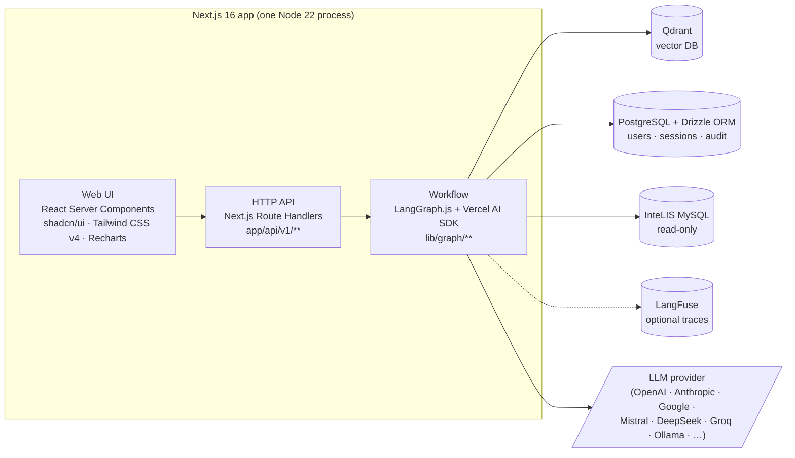
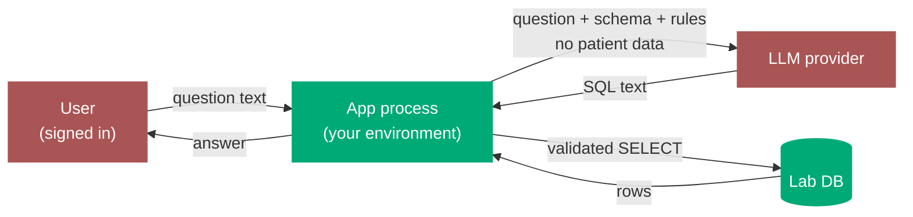
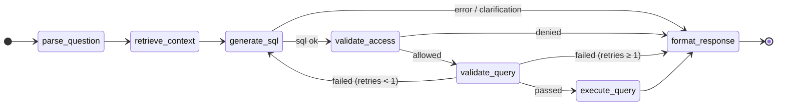
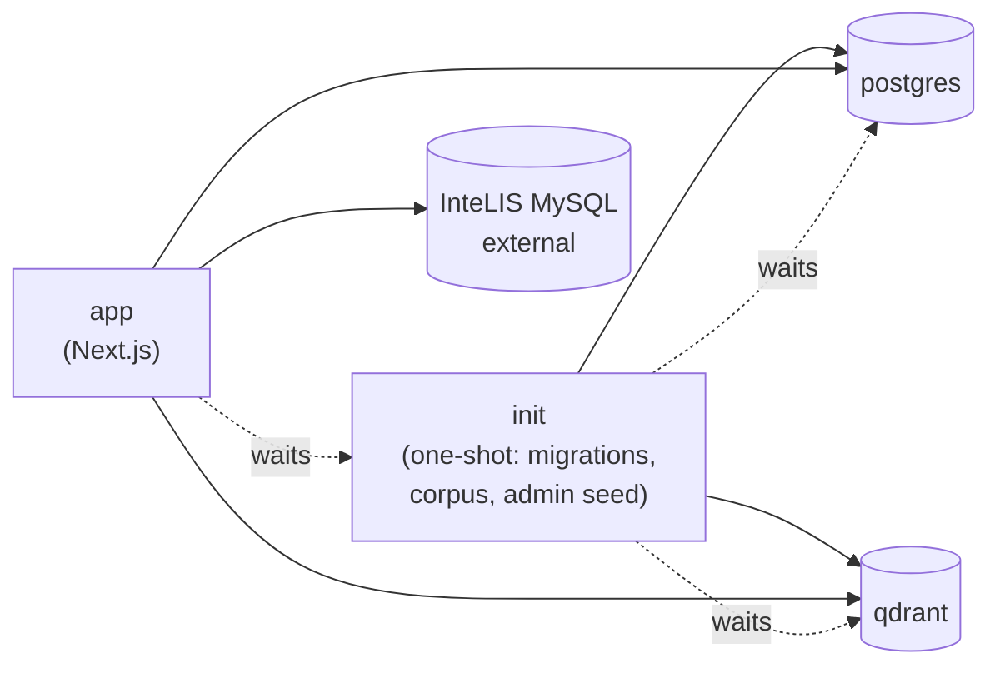

# Architecture

InteLIS Insights is a single Next.js application. The UI, the HTTP API, and the workflow that turns natural-language questions into SQL all run in one Node process.

For a step-by-step picture of what happens when a user asks a question, see [How a query flows](./query-flow.md).

## High-level

### Stack

Every load-bearing component is an industry-standard, permissively-licensed, FOSS project with an active maintainer community. No proprietary runtime, no SaaS dependency, no obscure framework that ties the codebase to one vendor or one contributor. A typical full-stack TypeScript engineer can be productive on day one.

| Concern | Choice | Why this, not the alternative |
|---|---|---|
| App framework | [Next.js 16](https://nextjs.org) (App Router) | Most widely deployed React framework. Huge talent pool. Vercel-led but fully self-hostable. |
| Workflow engine | [LangGraph.js](https://langchain-ai.github.io/langgraphjs/) | The de facto graph runtime for agentic LLM apps; checkpointing, retries, and observability built in. |
| LLM provider layer | [Vercel AI SDK](https://sdk.vercel.ai) | One API across every major provider — swap OpenAI / Anthropic / Google / local without code changes. |
| Vector DB | [Qdrant](https://qdrant.tech) | Production-grade, Apache-2.0, runs as a single container. Self-hosted; no per-vector pricing. |
| Auth | [Auth.js v5](https://authjs.dev) | Standard for Next.js auth; supports email/password today, SSO/SAML when ministries need it. |
| App database | [PostgreSQL](https://www.postgresql.org) + [Drizzle ORM](https://orm.drizzle.team) | The default boring choice. Every operator already knows how to run, back up, and monitor it. |
| UI | [shadcn/ui](https://ui.shadcn.com) + [Tailwind CSS v4](https://tailwindcss.com) | Copy-in components, no UI-library lock-in. Themeable per deployment. |
| Charts | [Recharts](https://recharts.org) | Composable React charts; renders in RSC; no commercial licence. |
| Observability | [LangFuse](https://langfuse.com) | Self-hostable LLM observability. Prompts, costs, latency, eval scores — all in one place. |
| Runtime | Node 22 LTS | Long-term support, broadly available in every cloud and on-prem environment. |

The combined effect: a country IT team operates four containers (app, init, Postgres, Qdrant) — all recognisable — and depends on zero hosted services beyond the LLM endpoint they choose.

!!! info "External boundary"
    The InteLIS MySQL database is the country's live, operational lab system. We are a **read-only consumer**. The credentials in `LAB_DB_*` should be granted `SELECT` only. This service never bundles, replicates, replaces, or migrates lab data.

## The most important rule

**The LLM never holds a database connection.**

The LLM only sees text: the user's question, the database *schema* (table and column names), and the business rules. It emits text: a SQL string with structured metadata. The application — not the LLM — opens the database connection, validates the SQL, and runs it.

This is enforced by the code shape, not by the prompt. Patient data never leaves the application boundary. Every SQL the LLM emits goes through validation and access-control checks before it touches the lab DB. See [Privacy & RBAC](./privacy-and-rbac.md).

## The workflow

Every question follows the same seven steps. Each step is a function that reads the current state and returns updates. Branching happens between steps — failures route to the response builder; SQL-safety failures get one retry.

| Step | What it does |
|---|---|
| **parse-question** | Looks at the question, picks the likely tables, detects "those" / "them" follow-ups. Pure pattern matching — no LLM call. |
| **retrieve-context** | Embeds the question, runs two parallel searches in Qdrant: one for general domain hints, one for table-specific facts. Builds a compact context bundle for the prompt. |
| **generate-sql** | Calls the LLM with the question + context + a schema listing. Gets back SQL plus the assumptions it applied (default time window, default test type, etc.). |
| **validate-access** | If the user is a district or province operator, injects a `WHERE` clause restricting results to their geographic scope. National users pass through. |
| **validate-query** | SELECT-only. Tables must be in the allowlist. No patient-identifier columns (with one carve-out: `COUNT(DISTINCT …)` is allowed for unique counts). |
| **execute-query** | Runs the SQL against the read-only lab DB. Enforces a hard `LIMIT 10000`. |
| **format-response** | Suggests a chart (table / line / bar / pie / scatter, etc.) based on the result shape. Writes the audit row. |

## What runs where

| Concern | Where it lives | Built on |
|---|---|---|
| Web UI | `app/(app)/**` | Next.js 16 React Server Components, shadcn/ui, Tailwind, Recharts. |
| HTTP API | `app/api/v1/**` | Next.js Route Handlers. One streaming endpoint for queries (`/api/v1/query`); REST for sessions and admin. |
| Workflow | `lib/graph/**` | LangGraph.js. Nodes, state, routing, Postgres-backed checkpointer. |
| Prompts + provider switch | `lib/llm/**` | Vercel AI SDK across OpenAI / Anthropic / Google / Mistral / DeepSeek / Groq / OpenAI-compatible / Ollama. |
| RAG client | `lib/rag/**` | Qdrant + embeddings + the schema loader. |
| Safety + RBAC | `lib/validation/**` | SQL validator + AST-based access control (custom, ~600 LOC). |
| Auth | `auth.ts`, `lib/auth/**` | Auth.js v5 with email/password. |
| Domain knowledge | `lib/config/business-rules.ts`, `lib/config/field-guide.ts` | Plain TypeScript modules. Ported from the retired PHP. The load-bearing IP. |
| Container bootstrap | `scripts/init.ts` | One-shot Node script: Drizzle migrations, RAG corpus ingest, admin seed. |

## Where state lives

| State | Storage |
|---|---|
| Users + access scopes | Postgres |
| Chat sessions + messages | Postgres |
| Audit log (every query) | Postgres |
| Conversation memory across turns | Postgres (LangGraph checkpointer) |
| Schema + business rules + terminology, embedded | Qdrant |
| Lab data (read-only) | InteLIS MySQL — external |

All four services run independently. Re-ingesting the corpus is a single command if the source MySQL schema changes; the init container does it automatically on first boot.

## Deployment shape

One Docker image, four services in compose:

`docker compose up -d` brings up Postgres + Qdrant, runs `init` to completion, then starts `app`. See [Getting started](./getting-started.md).

## Why a single app, not a service mesh

We considered splitting the LLM workflow into a dedicated backend service and keeping Next.js as a thin UI. We chose not to:

- One framework, one process, one Docker image. New contributors are productive on day one.
- Ministry IT teams see one service to operate.
- API and UI share types end-to-end with no shared-package step.
- React Server Components + a streaming `Response` handle the 10–15 second graph run with live progress updates.

Independent scaling isn't a real need at one-deployment-per-country. Operator simplicity is.

## See also

- [How a query flows](./query-flow.md) — visual walkthrough end to end.
- [Privacy & RBAC](./privacy-and-rbac.md) — the security model in depth.
- [Configuration](./configuration.md) — env vars and trade-offs.
- [Implementation plan](./plan.md) — current status and roadmap.
