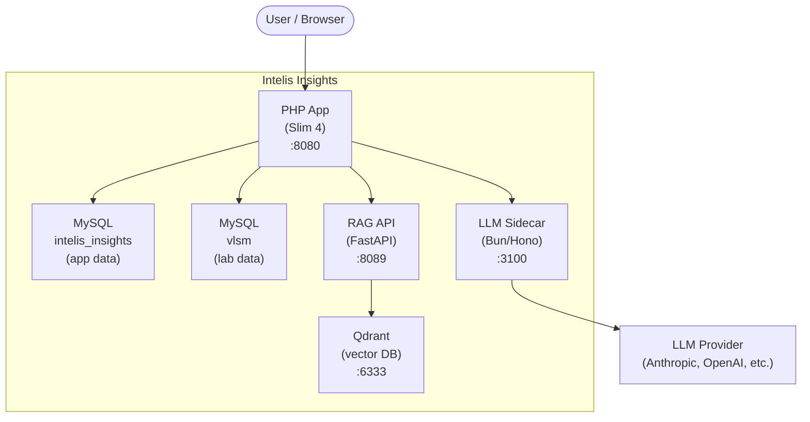
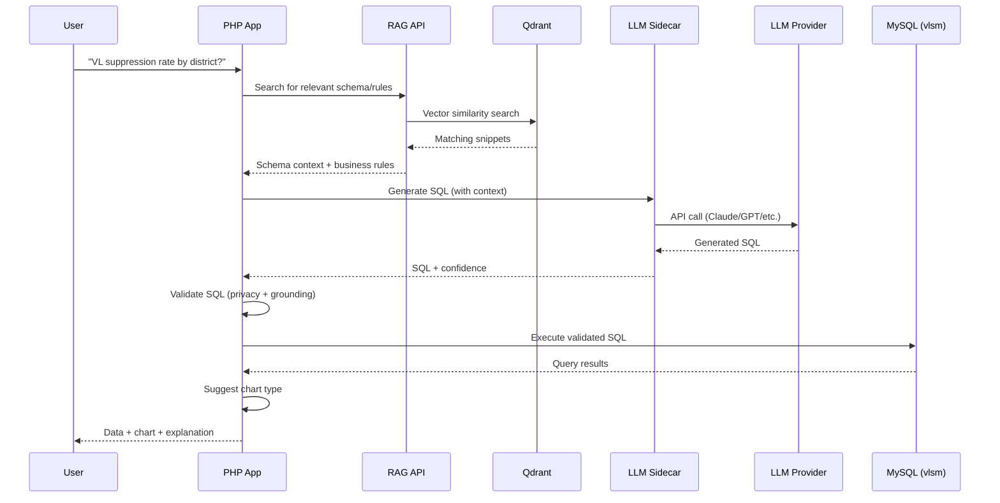

# Architecture Overview

Intelis Insights is made up of five services that work together. This page explains what each one does and how they connect.

## System Diagram



## Services

### PHP App (port 8080)

The main application. Serves the dashboard, chat interface, and REST API. Built with Slim 4 and Eloquent ORM.

- Renders the frontend (Tailwind CSS, Alpine.js, Chart.js)
- Handles the full [query pipeline](../reference/query-pipeline.md) — from question to SQL to chart
- Reads and writes to both MySQL databases
- Calls the LLM Sidecar and RAG API

### MySQL (port 3306)

A single MySQL 8.0 server hosts two databases. See [Two Databases](two-databases.md) for details.

- **`intelis_insights`** — Application data (reports, chat sessions, audit logs)
- **`vlsm`** — Laboratory data (the InteLIS database that LLM-generated SQL queries run against)

### LLM Sidecar (port 3100)

A lightweight gateway that routes LLM requests to the configured provider (Anthropic, OpenAI, DeepSeek, Google, Groq, or local Ollama). Written in TypeScript, runs on Bun.

- The PHP app never calls LLM APIs directly — it goes through the sidecar
- Supports streaming, structured output, tool calling, and embeddings
- Manages API keys and model aliases (e.g. `sonnet` → `anthropic:claude-sonnet-4-20250514`)

See [LLM Sidecar Reference](../reference/llm-sidecar.md) for details.

### RAG API (port 8089)

A Python FastAPI service that handles text embedding and semantic search. It converts text into vectors and searches for similar content in Qdrant.

- Embeds text using the `BAAI/bge-small-en-v1.5` model (runs locally, no API calls)
- On first start, downloads the embedding model (~200 MB) — this is cached for future starts
- Provides `/v1/upsert` (store snippets) and `/v1/search` (find similar snippets)

### Qdrant (port 6333)

An open-source vector database. Stores the embedded RAG snippets and performs fast similarity search.

- Holds ~2,400 snippets derived from the database schema, business rules, and field guide
- When the app needs context for SQL generation, it searches Qdrant for relevant snippets
- Has a built-in web dashboard at [localhost:6333/dashboard](http://localhost:6333/dashboard)

## Two Query Modes

The application has two distinct ways to query data:

### 1. Dashboard (No LLM)

Pre-defined national indicators. The SQL is hard-coded — no AI involved.

```
User → Dashboard → PHP App → MySQL (vlsm) → Charts
```

Fast, deterministic, always produces the same results.

### 2. Conversational Chat (LLM-Powered)

The user asks a question in plain English. The system uses RAG + LLM to generate SQL, validates it, executes it, and returns results with a chart.

```
User Question
  → PHP App
    → RAG API (find relevant schema/rules)
    → LLM Sidecar (generate SQL)
    → Validate SQL (privacy + grounding)
    → MySQL vlsm (execute SQL)
    → Chart suggestion
  → JSON Response with data + chart
```

See [Query Pipeline](../reference/query-pipeline.md) for a detailed step-by-step walkthrough.

## Data Flow


