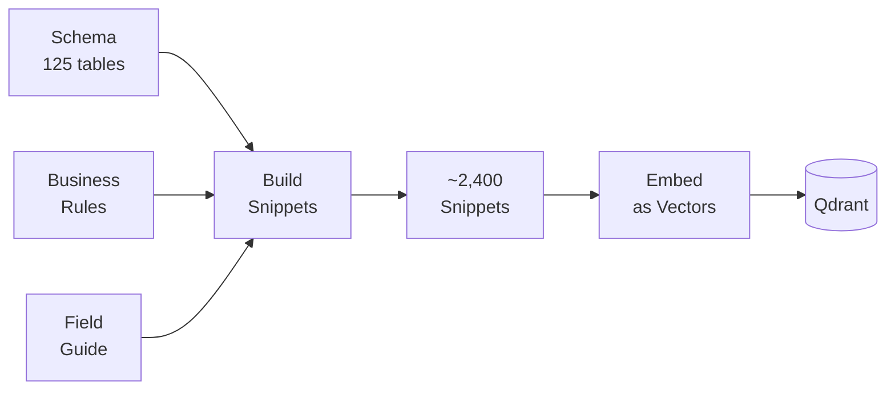
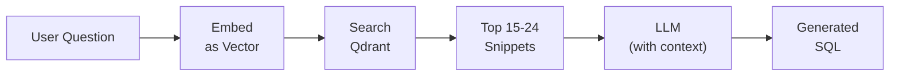

# RAG & Vector Search

RAG (Retrieval-Augmented Generation) is how Intelis Insights gives the LLM the context it needs to write accurate SQL. This page explains the concept and how it works in this system.

## The Problem

When a user asks *"What is the VL suppression rate by district?"*, the LLM needs to know:

- Which tables exist in the database (`form_vl`, `facility_details`, ...)
- Which columns are in those tables (`result_value_absolute`, `facility_state`, ...)
- Business rules ("suppressed" means `result_value_absolute < 1000`)
- Clinical thresholds, terminology, and query patterns

The LLM doesn't know any of this on its own. We need to tell it — but we can't send the entire database schema (125+ tables, thousands of columns) in every request. That would be too large and too expensive.

## The Solution: RAG

RAG works in two phases:

### Phase 1: Indexing (one-time setup)

Break the database schema, business rules, and field guide into small **snippets** (~2,400 of them). Convert each snippet into a **vector** (a list of numbers that captures its meaning). Store these vectors in a **vector database** (Qdrant).



### Phase 2: Retrieval (every question)

When a user asks a question, convert the question into a vector too. Search Qdrant for the snippets whose vectors are most similar to the question vector. These are the most relevant pieces of context.



The LLM only sees the relevant snippets — not the entire schema. This keeps the prompt small, focused, and accurate.

## Snippet Types

The system generates different types of snippets from different sources:

| Type | Source | Count (~) | Example |
|------|--------|-----------|---------|
| `column` | Database schema | ~1,500 | *"form_vl.result_value_absolute: int — the absolute viral load result in copies/ml"* |
| `table` | Database schema | ~125 | *"form_vl: Viral load test results. Columns: sample_tested_datetime, facility_name, ..."* |
| `rule` | `config/business-rules.php` | ~50 | *"Suppressed VL: result_value_absolute < 1000 copies/ml"* |
| `syn` | `config/field-guide.php` | ~80 | *"'suppression rate' means the percentage of results with value < 1000"* |
| `relationship` | Database schema | ~23 | *"form_vl.facility_id → facility_details.facility_id"* |
| `exemplar` | `config/field-guide.php` | ~30 | *"To count tests by district: SELECT fd.facility_state, COUNT(*) FROM form_vl ..."* |
| `threshold` | `config/field-guide.php` | ~20 | *"VL suppression threshold: < 1000 copies/ml"* |
| `test_type` | `config/field-guide.php` | ~15 | *"Viral Load tests are in form_vl, EID tests are in form_eid"* |
| `validation` | `config/business-rules.php` | ~40 | *"Always exclude rejected samples: IFNULL(is_sample_rejected, 'no') = 'no'"* |

## The Allowlist

After retrieving relevant snippets, the system compresses them into a compact **allowlist** — a structured block of text that tells the LLM exactly what it can use:

```
ALLOWLIST (you may ONLY use items from this list):

[TABLE] form_vl — Viral load test results
  Columns: sample_tested_datetime, facility_name, result_value_absolute, ...
[TABLE] facility_details — Facility metadata
  Columns: facility_name, facility_state, facility_district, ...

[RULE] Suppressed VL: result_value_absolute < 1000 copies/ml
[RULE] Always exclude rejected samples: IFNULL(is_sample_rejected, 'no') = 'no'

[PATTERN] VL suppression rate: COUNT(CASE WHEN result_value_absolute < 1000 ...) / COUNT(*)
```

The LLM is instructed to **only** use tables, columns, and patterns from this allowlist. This is the grounding mechanism that prevents hallucinated column names or wrong table references.

## Components

| Component | Role |
|-----------|------|
| **RAG API** (FastAPI, port 8089) | Embeds text into vectors and searches Qdrant |
| **Qdrant** (port 6333) | Stores and searches vectors |
| **Embedding model** (`BAAI/bge-small-en-v1.5`) | Converts text to 384-dimensional vectors. Runs locally inside the RAG API — no external API calls |

## Seeding & Refreshing

The RAG index needs to be built (seeded) once, and refreshed whenever the database schema or business rules change. See [RAG Seeding](../guides/rag-seeding.md) for the step-by-step process and when to use `rag-refresh` vs `rag-reset`.
