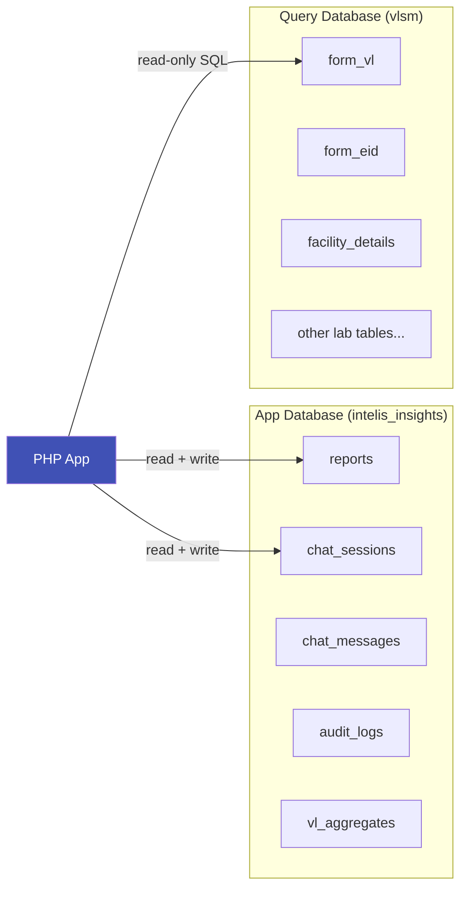

# Two Databases

Intelis Insights uses two separate MySQL databases for different purposes. This is one of the most important things to understand about the system.

## Why Two Databases?

Separation of concerns:

- The **app database** stores things Intelis Insights creates (reports, chat sessions, audit logs). It's fully managed by the application.
- The **query database** is your existing InteLIS laboratory data. The application only reads from it — never writes. LLM-generated SQL queries execute here.

## Overview



## App Database: `intelis_insights`

| What | Details |
| ---- | ------- |
| Default name | `intelis_insights` |
| Env variable | `DB_NAME` |
| Access | Read + Write |
| Created by | Docker init scripts or manual SQL migration |

**Tables include:**

- `reports` — Saved report definitions (title, plan, chart config)
- `chat_sessions` — Conversation sessions
- `chat_messages` — Individual chat messages within sessions
- `audit_logs` — Activity audit trail
- `vl_aggregates` — Pre-computed viral load aggregate tables (for the dashboard)

**Schema files** (run in order):

```
database/001_create_schema.sql
database/002_create_vl_aggregate_tables.sql
database/003_refresh_vl_aggregates.sql
database/004_system_tables.sql
database/seed.sql
```

With Docker, these run automatically on first start. For manual setup, see [Manual Setup](../getting-started/manual-setup.md#3-create-the-app-database).

## Query Database: `vlsm`

| What | Details |
| ---- | ------- |
| Default name | `vlsm` |
| Env variable | `QUERY_DB_NAME` |
| Access | **Read-only** |
| Created by | You — imported from an InteLIS dump or pointed at an external instance |

This is the InteLIS Laboratory Information System database. It contains tables like:

- `form_vl` — Viral Load test results
- `form_eid` — Early Infant Diagnosis results
- `facility_details` — Laboratory and facility metadata
- `r_vl_test_reasons` — Reference table for VL test reasons
- And many more (~125 tables typically)

The application never writes to this database. LLM-generated SQL runs against it as read-only queries.

## Environment Variables

The two databases have separate connection settings in `.env`:

```bash
# ── App Database ──────────────────────
DB_HOST=127.0.0.1
DB_PORT=3306
DB_NAME=intelis_insights
DB_USER=root
DB_PASSWORD=your-password

# ── Query Database ────────────────────
QUERY_DB_NAME=vlsm
QUERY_DB_HOST=         # falls back to DB_HOST if empty
QUERY_DB_USER=         # falls back to DB_USER if empty
QUERY_DB_PASSWORD=     # falls back to DB_PASSWORD if empty
```

When `QUERY_DB_HOST` is empty, the query database is assumed to be on the same MySQL server as the app database. Set it to point to a different server (e.g. your production InteLIS instance).

## Common Scenarios

### Both on the same MySQL server (default)

```bash
DB_HOST=127.0.0.1
DB_NAME=intelis_insights
QUERY_DB_NAME=vlsm
# QUERY_DB_HOST left empty → uses DB_HOST
```

### Query database on an external server

```bash
DB_HOST=127.0.0.1
DB_NAME=intelis_insights
QUERY_DB_NAME=vlsm
QUERY_DB_HOST=lab-db-server.example.com
QUERY_DB_USER=readonly_user
QUERY_DB_PASSWORD=readonly_pass
```

See [Connecting InteLIS Data](../guides/connecting-intelis-data.md) for step-by-step instructions.
