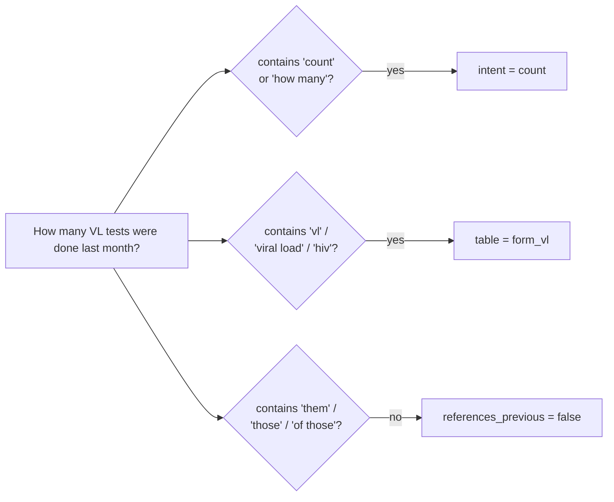
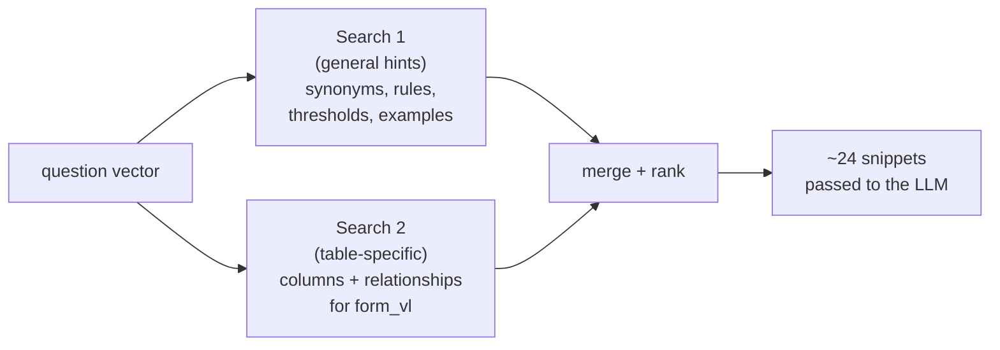
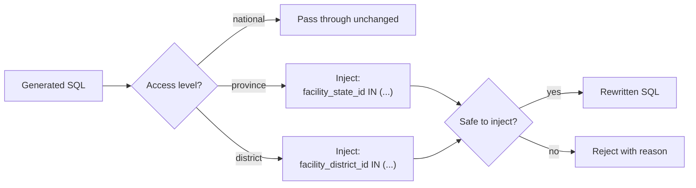

# How a query flows

What happens, in order, when someone asks **"How many VL tests were done last month?"** in the chat.

The whole thing takes 5–15 seconds. The UI streams progress as it goes, so the user sees each step tick by instead of staring at a spinner.

## The journey, in one picture

```mermaid
sequenceDiagram
  autonumber
  actor User as User
  participant UI as Browser
  participant API as POST /api/v1/query
  participant Wf as Workflow
  participant Qd as Qdrant
  participant LLM as LLM provider
  participant Db as InteLIS MySQL
  participant Pg as Postgres (audit)

  User->>UI: Types question, presses Enter
  UI->>API: { question, sessionId? }
  API->>API: Auth check → user + scope
  API->>Pg: Save user message; create session if new
  API->>Wf: Run the workflow

  Wf-->>UI: "parse-question"
  Wf->>Wf: Pattern match → table = form_vl, intent = count

  Wf-->>UI: "retrieve-context"
  Wf->>LLM: Embed the question
  Wf->>Qd: Search relevant snippets (×2)
  Qd-->>Wf: ~24 column/rule/example snippets

  Wf-->>UI: "generate-sql"
  Wf->>LLM: Question + context + schema → structured SQL
  LLM-->>Wf: { sql, assumptions, citations, confidence }

  Wf-->>UI: "validate-access"
  Wf->>Wf: Scope check (national user → pass through)

  Wf-->>UI: "validate-query"
  Wf->>Wf: SELECT-only, allow-list, PII guard

  Wf-->>UI: "execute-query"
  Wf->>Db: Run SQL (read-only pool)
  Db-->>Wf: 1 row: 9,990

  Wf-->>UI: "format-response"
  Wf->>Wf: Pick chart type (single-row → KPI)

  API->>Pg: Save assistant message + audit row
  API-->>UI: "done" { auditId, durationMs }
  UI->>User: Renders the answer
```

Below, each numbered band of that diagram, in plain English.

---

## 1 — The browser sends the question

The user types a question and hits Enter. The browser POSTs to `/api/v1/query` with:

```json
{ "question": "How many VL tests were done last month?",
  "sessionId": "abc-123" }
```

The response isn't JSON — it's an [NDJSON](https://github.com/ndjson/ndjson-spec) stream. Each line is a small event. The browser reads them as they arrive and updates the UI piece by piece.

## 2 — The API checks who you are

Before anything else, the route handler calls Auth.js to confirm the request is signed in. It pulls your access level (national / province / district) and your allowed geographies. These become the **user context** that gets passed to every downstream check.

If you don't have a session yet, the API creates one in Postgres and saves your question as the first message.

## 3 — Parse the question

The workflow's first step is pure pattern matching against the question text — no LLM call, no API hop.



For this question:

```text
intent      = count
table       = form_vl
test type   = vl
references-previous = no
```

This is fast and deterministic. It's also the only thing in the pipeline that doesn't call an external service. Why no LLM here? Because routing decisions don't need one — the vocabulary the system handles is small and well-defined.

## 4 — Retrieve context from the vector DB

The system needs to remind itself what `form_vl` looks like, what "VL" means in this domain, and how rejected samples should be handled.

It embeds the question (turns it into a numeric vector) and runs **two parallel searches** in Qdrant:



Two searches, not one, because they have different jobs:

- **Search 1** pulls *cross-cutting* facts — what "VL" means, the rejection-rate convention, exemplar SQL patterns. These should always show up regardless of which table the question hits.
- **Search 2** pulls *table-specific* facts — what columns `form_vl` has, how it joins to `facility_details`. These should be filtered to the tables the question is about.

The merged set (capped at 24 items) plus a concise schema listing of the candidate tables is what the LLM will see next.

## 5 — Generate the SQL

This is the only step that costs LLM money on a typical query.

The system sends the LLM:

- A **system prompt** describing the rules (SELECT-only, no patient identifiers, alias every column, use the listed join paths, etc.).
- A **user prompt** with: the available tables, the retrieved snippets, the prior conversation (if any), and the question itself.
- A **schema** for the response (using OpenAI's structured-output mode, Anthropic's tool calling, or plain JSON mode depending on the provider).

The LLM replies with a typed object:

```json
{
  "sql": "SELECT COUNT(*) AS \"Total VL Tests\" FROM form_vl ...",
  "confidence": 0.9,
  "assumptions": [
    "Filtered to the previous calendar month by default.",
    "Excluded rejected samples by convention."
  ],
  "citations": ["table:form_vl", "rule:default_assumptions.7"],
  "clarificationNeeded": null
}
```

The `assumptions` array is what the UI shows the user — it builds trust by surfacing the defaults the model applied. If the model can't answer confidently, it returns `clarificationNeeded` instead of bad SQL and the UI asks a follow-up.

## 6 — Enforce access scope

The user might be a **district operator** who should only see their districts, or a **province operator**, or a **national administrator** who sees everything.



The injection parses the SQL into an abstract syntax tree, finds the `facility_details` table reference, and adds a `WHERE` clause restricting it. If the SQL contains a CTE or a subquery the injector doesn't yet handle, the query is **rejected** rather than silently mis-applied. The user sees a clear reason.

For our example question, the user is national-level, so the SQL passes through unchanged.

## 7 — Validate the SQL is safe

A safety net regardless of who's asking:

| Check | What it catches |
|---|---|
| Must start with `SELECT` | An LLM that tries `DROP TABLE` despite the prompt. |
| Every table must be in the allowlist | An LLM hallucinating `secret_admin_table`. |
| No forbidden patient-identifier columns | `patient_first_name`, `patient_id`, phone, email, etc. |
| `COUNT(DISTINCT patient_id)` carve-out | Anonymous uniqueness counts are allowed. |
| No `DROP`, `DELETE`, `UPDATE`, `UNION`, `INFORMATION_SCHEMA`, … | Belt-and-suspenders against escapes. |

If validation fails, the workflow gives the LLM **one retry** with the error message attached as context. If the retry also fails, the user sees the error stage explained.

## 8 — Execute against the lab DB

The validated SQL runs against the InteLIS MySQL pool. The pool is configured **read-only** (the operator provisions the user with `GRANT SELECT` only). A hard `LIMIT 10000` is appended if the SQL didn't include one.

The result is just rows + columns + execution time. For our example: one row, one column, value `9990`.

## 9 — Pick a chart type

Based on the result shape, the system suggests how to display it:

- **One row, one or two columns** → big KPI number (our example)
- **Time column + numeric column** → line or area chart
- **One category + one numeric** → pie (≤7 categories) or bar (more)
- **Two categories + numeric** → stacked bar
- **Two numerics** → scatter
- **Anything wider than ~6 columns** → table

If none of those fit cleanly, a small/fast model is asked to pick (this is the only place the secondary "fast" model gets used).

## 10 — Audit and respond

Before the response is finalised:

- A row is written to `audit_log` with the question, the generated SQL, the rewritten SQL (if different), the access decision, the row count, the duration, any error, the trace ID, and the LLM model + token usage.
- The assistant's response is saved to `chat_messages` so the UI can show this turn on a later visit.
- (Optional) LangFuse receives a trace with one span per workflow node and a `generation` event for the SQL-gen LLM call.

The browser receives a final `done` event with the audit ID and total duration, and renders the answer:

> **Total VL Tests**
> **9,990**

…plus the SQL the model generated, the assumptions it applied, the citations from the corpus, and the stats panel (1 row, 1,125 ms SQL execution, 6.0 s end-to-end).

---

## What the user sees while this happens

The whole pipeline emits events as it runs. The chat UI binds each event to a state update:

| Event | What the UI does |
|---|---|
| `session` | Stores the session ID; sets the trace ID for "show details" later. |
| `stage` | Advances the progress indicator (one tick per workflow step). |
| `intent` | Shows the detected intent / table inline. |
| `rag` | Shows the number of citations gathered. |
| `sql` | Renders the generated SQL block with the confidence + assumptions tile. |
| `access` | Surfaces the scope-injection notice if RBAC rewrote the query. |
| `results` | Renders the table or KPI hero. |
| `chart` | Renders the chart in the Visualization tile. |
| `error` | Shows the error card with the stage and message. |
| `done` | Marks the turn complete; stops the progress animation. |

That's why the response feels "live" — the SQL appears mid-way through the pipeline, the chart appears once execution finishes, all without page reloads or full-screen spinners.

---

## What happens on a follow-up

A second question in the same chat — say, **"Split that by province"** — follows exactly the same flow, with one addition: before sending the question to the LLM, the system attaches the **previous turn's question and the SQL the LLM produced for it**, after stripping any forbidden columns. That gives the model continuity ("that" = "VL tests last month") without resending raw lab data.

The conversation state is checkpointed in Postgres per session, so you can close the browser and come back later and the model still knows what "that" referred to.

---

## See also

- [Architecture](./architecture.md) — system shape and module map.
- [Privacy & RBAC](./privacy-and-rbac.md) — the security and scope-enforcement model.
- [LLM providers](./llm-providers.md) — choosing a provider, including the trade-offs.
